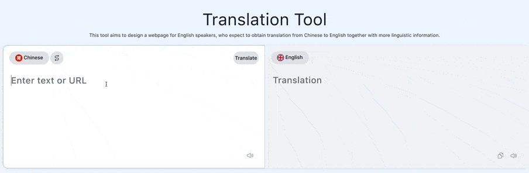

# Project Title
An aid to learning to read foreign languages

# Project Description
The main content of this project is to build a simple Chinese-English translation web tool, which supports users to paste URL, extract paragraph text from it and translate automatically, users can also choose to paste the paragraph or word they want to translate manually. 
ASR part is added to behave as an auxiliary input method,  therefore AST+MT can be bounded as a Spoken Language Translation(SLT).
ASR part is inspired by wav2letter which is proposed by FaceBook in 2017. The model of ASR is a solely CNN end to end speech recognition experiment.

# Demo-Preview


# Table of contents
Algorithm folder is to store different finished machine translation algoirthms.
Corpus folder is to store different corpora used in machine translation.
Demo_FrontEnd folder is used to make representation for demo.
bysms folder is to store the whole system embedded into Django framework.
database folder is to store the files related to databese format converting.
results folder is to store the evalution files for machine tranlation algoirthms.
speech2text folder is to store files related to speech recognition.
requirements file is to store all the packages and testing softwares needed to installed in the local computer.

# Installation
To use this project, first clone the repo on your device using the command below:

```git clone https://github.com/michelle-chou25/An-aid-to-learning-to-read-foreign-languages.git```

Then according to the requirements file to install packages and testing softwares.

Then using the command below (enter into bysms folder):

```cd /Users/username/VScodeProjects/ProjectName/bysms```

After the Django server part and MongoDB part start, input the URL http://127.0.0.1:8000/view/ in the browser

(the port number 8000 needs to be change into the default port number of the used computer).

Then the word query and sentence translation can be done in the FrontEnd part.

## Machine Translation Model
The Google Drive link for trained Machine Translation models are as follows: 
(Format: Corpus name_Algorithm name_Translation direction)
1.	Corpus1w_Transformer_Chinese-English:
https://drive.google.com/file/d/11269OHJtp9E6xLK1V2RdPEVDKj9ImljQ/view?usp=sharing
2.	Corpus1w_Transformer_English-Chinese:
https://drive.google.com/file/d/12V2-ysI5hJpd7iY0OMkYBZpjhFg0cWUE/view?usp=sharing
3.	Corpus1w_seq2seq+attention_Chinese-English:
https://drive.google.com/drive/folders/1-P3U4B7RNtwdeeM0KjpyfHB7Aji4s8nq?usp=sharing
4.	Corpus_education_Transformer_Chinese-English:
https://drive.google.com/drive/folders/1-R4lTnch3UEF_BQTAeUS74Yk9lSH5jIj?usp=sharing
5.	Seq2seq_testcorpus_ seq2seq+attention_Chinese-English:
https://drive.google.com/drive/folders/1UXjT5NN3JdNIImfNdWg3bHCXCNIPi9Ne?usp=sharing
6. ASR model
https://drive.google.com/file/d/1n9zJQhNyEXAlD6nQVULpHOov1A5tSr2W/view?usp=sharing


## Corpora
All used machine translation corpora can be downloaded by this link (after the corpora downloaded, put the corpora into Corpus folder)
https://drive.google.com/file/d/1lAh29Qxmo1oqa9WphnU3K7L4CNGRVv4L/view?usp=sharing

ASR copus uses AISHELL-1, which is a Chinese madrian corpus inludes 178 hours speech recording of Chinese news, this corpus is conducted in a quiet room, from 400 people.
Corpus address: https://www.openslr.org/33/


## Requirement package
see requirements file

# Contributors
Ruochen Xue & Nanjun Zhou


